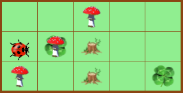

# Blockly-Kara

Basiert auf

```
BlocklyKara, Version 1.0 (06.10.2021)
Entwicklerin: Vikoriia Atamanska
Ansprechpartner: Dietrich Boles (dietrich.boles@uni-oldenburg.de)
Web: http://www.boles.de/blockly-mpws/index.html
```

siehe [README.txt](README.txt)

## Änderungen

- Kommandos (wie `onLeaf`) ins Deutsche übersetzt
- Welten als einfach editierbare ASCII-Dateien

## .world-Dateien

Kara-Welten können als `.world`-Dateien gespeichert bzw. aus solchen geladen werden. Eine `.world`-Datei ist dabei eine gewöhnliche Plain Text Datei, z.B.
```
..P..
ORB..
P.B.K
```



Dabei gilt folgende Legende:
| Symbol | Bedeutung |
|:------:|:----------|
| . | leer |
| B | **B**aum |
| K | **K**leeblatt |
| P | **P**ilz |
| R | Kleeblatt und Pilz .. **K** und **B** zu **R** kombiniert |
| N/O/S/W | Kara schaut nach `N`orden/`O`osten/`S`üden/`W`esten |

*Bemerkung:* Zwar können so zwar mehrere Karas beschrieben werden, allerdings zählt nur der "unterste" Akteur - alle anderen werden ignoriert.